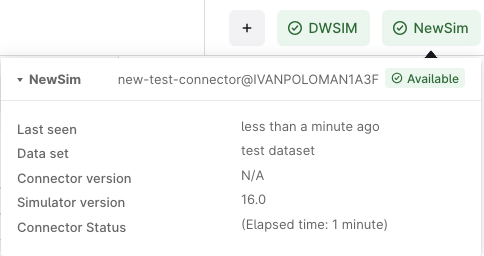

# Implement COM connection

To run simulations using the Cognite simulator integration, connect to a simulator using the `COM` interface.
In the example, we use Excel as a `simulator` and fetch its version number.

## Create a class that inherits from AutomationConfig

Set the `COM` program ID so the connector knows which program to connect to.

`NewSimAutomationConfig.cs`:
```csharp
using Cognite.Simulator.Utils.Automation;

public class NewSimAutomationConfig : AutomationConfig
{
    public NewSimAutomationConfig()
    {
        ProgramId = "Excel.Application";
    }
}
```

Adjust the `ConnectorRuntime` class to use the `NewSimAutomationConfig` class. Replace every instance of `AutomationConfig` with `NewSimAutomationConfig`.

```csharp
using Cognite.Simulator.Utils;
using Cognite.Simulator.Utils.Automation;
using CogniteSdk.Alpha;
using Microsoft.Extensions.DependencyInjection;

public static class ConnectorRuntime {

    public static void Init() {
        DefaultConnectorRuntime<NewSimAutomationConfig, DefaultModelFilestate, DefaultModelFileStatePoco>.ConfigureServices = ConfigureServices;
        DefaultConnectorRuntime<NewSimAutomationConfig, DefaultModelFilestate, DefaultModelFileStatePoco>.ConnectorName = "NewSim";
        DefaultConnectorRuntime<NewSimAutomationConfig, DefaultModelFilestate, DefaultModelFileStatePoco>.SimulatorDefinition = SimulatorDefinition.Get();
    }
    static void ConfigureServices(IServiceCollection services)
    {
        services.AddScoped<ISimulatorClient<DefaultModelFilestate, SimulatorRoutineRevision>, NewSimClient>();
    }
    
    public static async Task RunStandalone() {
        Init();
        await DefaultConnectorRuntime<NewSimAutomationConfig, DefaultModelFilestate, DefaultModelFileStatePoco>.RunStandalone().ConfigureAwait(false);
    }
}
```

### Extend the NewSimClient class to inherit from the AutomationClient class

To access the `COM` object, extend the `NewSimClient` class to inherit from the `AutomationClient` class. 
Add `using Cognite.Simulator.Utils.Automation;` namespace to `NewSimClient` class and extend the class to inherit from `AutomationClient`. Then, add a new constructor that calls the base constructor with the AutomationConfig type.

Replace the lines in the `NewSimClient` class:

```csharp
using Cognite.Simulator.Utils;
using CogniteSdk.Alpha;

public class NewSimClient : ISimulatorClient<DefaultModelFilestate, SimulatorRoutineRevision>
{
// rest of the class
```

with the lines below:

```csharp
using Cognite.Simulator.Utils;
using Cognite.Simulator.Utils.Automation;
using CogniteSdk.Alpha;
using Microsoft.Extensions.Logging;

public class NewSimClient : AutomationClient, ISimulatorClient<DefaultModelFilestate, SimulatorRoutineRevision>
{
    private readonly SemaphoreSlim semaphore = new SemaphoreSlim(1, 1);
    private readonly string _version = "N/A";

    public NewSimClient(ILogger<NewSimClient> logger, DefaultConfig<NewSimAutomationConfig> config)
            : base(logger, config.Automation)
    {
        semaphore.Wait();
        try
        {
            Initialize();
            _version = Server.Version;
        }
        finally
        {
            Shutdown();
            semaphore.Release();
        }
    }
    // rest of the class
```

In the constructor, initialize the `COM` connection and get the Excel application's version number. The field `_version` stores the version number. When you connect to the simulator, use a semaphore to avoid using multiple threads to access the `COM` object at the same time.

Also, add a method that closes the Excel application when the `COM` connection is closed.

```csharp
protected override void PreShutdown()
{
    Server.Quit();
}
```

Update the `GetSimulatorVersion` method to return the version number.

```csharp
public string GetSimulatorVersion()
{
    return _version;
}
```
When you run the connector, you'll see the version number in [CDF](https://fusion.cognite.com/).

