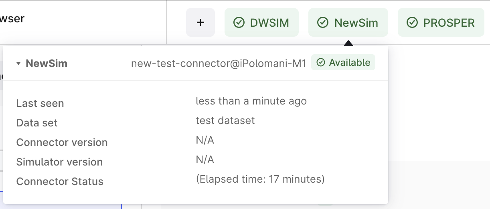

# Create your first connector

In this tutorial, you'll build a working Excel-based simulator connector from scratch. By the end, you'll have a connector that:

- Connects to Excel via COM automation
- Reports its version and heartbeat to CDF
- Opens and validates Excel workbooks

## What you'll build

We'll create an Excel connector that demonstrates the core SDK patterns. The final structure will match the [Sample.BasicComConnector](../../Sample.BasicComConnector):

```
Sample.BasicComConnector/
├── Program.cs                    # Entry point
├── ConnectorRuntime.cs           # Dependency injection setup
├── SimulatorDefinition.cs        # Contract with CDF
├── NewSimAutomationConfig.cs     # Configuration
├── NewSimClient.cs               # Simulator client implementation
├── NewSimRoutine.cs              # Routine implementation (added later)
└── config.yml                    # Connector configuration
```

## Prerequisites

Before starting, make sure you've completed the [Prerequisites & Setup](prerequisites.md) guide:

## Step 1: Create a new simulator connector project

Create a new console application:

```bash
dotnet new console -o Sample.BasicComConnector
cd Sample.BasicComConnector
```

Add the Simulator Utils package:

```bash
dotnet add package Cognite.Simulator.Utils --prerelease
```

> **Note:** The `--prerelease` flag is required while the package is in beta.

## Step 2: Create a configuration file

Create a `config.yml` file in your project root. This file contains CDF connection settings and connector configuration.

```yaml
version: 1

logger:
    console:
        level: "debug"

cognite:
    project: ${COGNITE_PROJECT}
    host: ${COGNITE_HOST}
    # This is for Microsoft Entra as an IdP. To use a different provider:
    # set implementation: Basic, and use token-url instead of tenant.
    # See the example config for the full list of options.
    idp-authentication:
        # Directory tenant
        tenant: ${COGNITE_TENANT_ID}
        # Application ID
        client-id: ${COGNITE_CLIENT_ID}
        # Client secret
        secret: ${COGNITE_CLIENT_SECRET}
        # List of resource scopes. Example:
        # scopes:
        #   - https://api.cognitedata.com/.default
        scopes:
          - ${COGNITE_SCOPE}

connector:
  name-prefix: "new-sim-connector@"
  # Data set ID to keep all the simulator resources
  data-set-id: ${COGNITE_DATA_SET_ID}
```

## Step 3: Define the Simulator contract

Create `SimulatorDefinition.cs`. This defines the contract between your simulator and CDF.

```csharp
using CogniteSdk.Alpha;

static class SimulatorDefinition
{
    public static SimulatorCreate Get()
    {
        return new SimulatorCreate
        {
            ExternalId = "Excel",
            Name = "Excel",
            FileExtensionTypes = new List<string> { "xlsx", "xlsm" },
            ModelTypes = new List<SimulatorModelType>
            {
                new SimulatorModelType
                {
                    Name = "Spreadsheet",
                    Key = "Spreadsheet",
                }
            },
            StepFields = new List<SimulatorStepField>
            {
                // Define fields for Set/Get operations
                new SimulatorStepField
                {
                    StepType = "get/set",
                    Fields = new List<SimulatorStepFieldParam>
                    {
                        new SimulatorStepFieldParam
                        {
                            Name = "sheet",
                            Label = "Sheet Name",
                            Info = "Name of the worksheet (e.g., 'Sheet1')",
                        },
                        new SimulatorStepFieldParam
                        {
                            Name = "cell",
                            Label = "Cell Reference",
                            Info = "Excel cell reference (e.g., 'A1', 'B2', 'C3')",
                        },
                    },
                },
                // Define fields for Command operations
                new SimulatorStepField
                {
                    StepType = "command",
                    Fields = new List<SimulatorStepFieldParam>
                    {
                        new SimulatorStepFieldParam
                        {
                            Name = "command",
                            Label = "Command",
                            Info = "Select a command",
                            Options = new List<SimulatorStepFieldOption>
                            {
                                new SimulatorStepFieldOption
                                {
                                    Label = "Pause Calculations",
                                    Value = "Pause",
                                },
                                new SimulatorStepFieldOption
                                {
                                    Label = "Perform Calculation",
                                    Value = "Calculate",
                                }
                            },
                        },
                    },
                },
            },
            UnitQuantities = new List<SimulatorUnitQuantity>
            {
                new SimulatorUnitQuantity
                {
                    Name = "Unitless",
                    Label = "Unitless",
                    Units = new List<SimulatorUnitEntry>
                    {
                        new SimulatorUnitEntry { Name = "", Label = "" },
                    },
                },
            },
        };
    }
}
```

**What this defines:**

- **FileExtensionTypes**: Excel file types (`.xlsx`)
- **ModelTypes**: Types of models (here, just "Spreadsheet")
- **StepFields**: How to address cells (sheet name + cell reference) and run commands
- **UnitQuantities**: Units the simulator can handle (here, just "Unitless" for simplicity)

This contract is registered with CDF when your connector starts, allowing CDF to understand your simulator's capabilities.

## Step 4: Create COM Configuration

Create `NewSimAutomationConfig.cs`. This tells the SDK how to connect to Excel via COM.

```csharp
using Cognite.Simulator.Utils.Automation;

public class NewSimAutomationConfig : AutomationConfig
{
    public NewSimAutomationConfig()
    {
        ProgramId = "Excel.Application";
    }
}
```

**About COM Program IDs:**
- `Excel.Application` is the registered COM identifier for Excel
- Other simulators have different Program IDs (e.g., `DWSIM.Automation` for DWSIM)

## Step 5: Implement the Simulator Client

Create `NewSimClient.cs`. This implements the `ISimulatorClient` interface, which the SDK uses to interact with your simulator.

```csharp
using Cognite.Simulator.Utils;
using Cognite.Simulator.Utils.Automation;
using CogniteSdk.Alpha;
using Microsoft.Extensions.Logging;

public class NewSimClient : AutomationClient, ISimulatorClient<DefaultModelFilestate, SimulatorRoutineRevision>
{
    private readonly SemaphoreSlim semaphore = new SemaphoreSlim(1, 1);
    private readonly string _version = "N/A";
    private readonly ILogger logger;

    public NewSimClient(ILogger<NewSimClient> logger, DefaultConfig<NewSimAutomationConfig> config)
            : base(logger, config?.Automation)
    {
        this.logger = logger;
        semaphore.Wait();
        try
        {
            Initialize();
            _version = Server.Version;
        }
        finally
        {
            Shutdown();
            semaphore.Release();
        }
    }

    public Task TestConnection(CancellationToken _token)
    {
        return Task.CompletedTask;
    }

    protected override void PreShutdown()
    {
        Server.Quit();
    }

    public dynamic OpenBook(string path)
    {
        dynamic workbooks = Server.Workbooks;
        return workbooks.Open(path);
    }

    public async Task ExtractModelInformation(DefaultModelFilestate state, CancellationToken token)
    {
        ArgumentNullException.ThrowIfNull(state);
        await semaphore.WaitAsync(token).ConfigureAwait(false);
        try
        {
            Initialize();
            dynamic workbook = OpenBook(state.FilePath);
            if (workbook != null)
            {
                workbook.Close(false);
                state.ParsingInfo.SetSuccess();
                return;
            }
            state.ParsingInfo.SetFailure();
        }
        finally
        {
            Shutdown();
            semaphore.Release();
        }
    }

    public string GetConnectorVersion(CancellationToken _token)
    {
        return "N/A";
    }

    public string GetSimulatorVersion(CancellationToken _token)
    {
        return _version;
    }

    public async Task<Dictionary<string, SimulatorValueItem>> RunSimulation(DefaultModelFilestate modelState, SimulatorRoutineRevision routineRev, Dictionary<string, SimulatorValueItem> inputData, CancellationToken token)
    {
        ArgumentNullException.ThrowIfNull(modelState);
        await semaphore.WaitAsync(token).ConfigureAwait(false);
        dynamic? workbook = null;
        try
        {
            Initialize();
            workbook = OpenBook(modelState.FilePath);

            var routine = new NewSimRoutine(workbook, routineRev, inputData, logger);
            return routine.PerformSimulation(token);
        }
        finally
        {
            if (workbook != null)
            {
                workbook.Close(false);
            }
            Shutdown();
            semaphore.Release();
        }
    }
}
```

**Key patterns to notice:**

1. **Inheritance**: `NewSimClient : AutomationClient` provides COM automation helpers
2. **Semaphore**: Ensures only one thread accesses Excel at a time (COM requirement)
3. **Initialize/Shutdown**: Lifecycle management for COM connection
4. **`Server` property**: `dynamic` object representing Excel (from `AutomationClient`)
5. **OpenBook helper**: Encapsulates workbook opening logic
6. **ArgumentNullException.ThrowIfNull**: Validates parameters

## Step 6: Configure Dependency Injection

Create `ConnectorRuntime.cs`. This sets up the SDK runtime and dependency injection.

```csharp
using Cognite.Simulator.Utils;
using Cognite.Simulator.Utils.Automation;
using CogniteSdk.Alpha;
using Microsoft.Extensions.DependencyInjection;

public static class ConnectorRuntime
{
    public static void Init()
    {
        DefaultConnectorRuntime<NewSimAutomationConfig, DefaultModelFilestate, DefaultModelFileStatePoco>.ConfigureServices = ConfigureServices;
        DefaultConnectorRuntime<NewSimAutomationConfig, DefaultModelFilestate, DefaultModelFileStatePoco>.ConnectorName = "NewSim";
        DefaultConnectorRuntime<NewSimAutomationConfig, DefaultModelFilestate, DefaultModelFileStatePoco>.SimulatorDefinition = SimulatorDefinition.Get();
    }

    static void ConfigureServices(IServiceCollection services)
    {
        services.AddScoped<ISimulatorClient<DefaultModelFilestate, SimulatorRoutineRevision>, NewSimClient>();
    }

    public static async Task RunStandalone()
    {
        Init();
        await DefaultConnectorRuntime<NewSimAutomationConfig, DefaultModelFilestate, DefaultModelFileStatePoco>.RunStandalone().ConfigureAwait(false);
    }
}
```

**What this does:**

- **ConfigureServices**: Registers `NewSimClient` for dependency injection
- **ConnectorName**: Sets the connector name to "NewSim" (used in CDF)
- **SimulatorDefinition**: Provides the contract we defined earlier
- **RunStandalone**: Starts the connector runtime

## Step 7: Create Program Entry Point

Replace the contents of `Program.cs`:

```csharp
public class Program
{
    public static int Main(string[] args)
    {
        RunStandalone();
        return 0;
    }

    private static void RunStandalone()
    {
        ConnectorRuntime.RunStandalone().Wait();
    }
}
```

**Key points:**
- **Main method**: Entry point that starts the connector runtime
- **Synchronous wait**: `.Wait()` blocks until the connector is shut down
- **Return code**: Returns 0 on success (convention for process exit codes)

## Step 8: Build and Run

Build the project:

```bash
dotnet build
```

If successful, you should see:
```
Build succeeded.
```

Run the connector:

```bash
dotnet run
```

## Step 9: Verify in CDF

Open Cognite Data Fusion in your browser and navigate to **Simulators**,

You should see:

1. **Your connector listed** with a green "Connected" status
2. **Simulator name**: "Excel"
3. **Version information**: Your Excel version
4. **Last heartbeat**: Should be recent (within last minute)



**If you don't see your connector:**
- Check CDF credentials in `config.yml`
- Check logs for authentication errors
- Ensure Data Set ID exists and is accessible

## Understanding What Happens at Runtime

When you run `dotnet run`, here's what happens:

1. **Configuration loaded** from `config.yml`
2. **COM connection established** to Excel (via `NewSimAutomationConfig`)
3. **Excel version retrieved** (in `NewSimClient` constructor)
4. **CDF authentication** using credentials from config
5. **Simulator definition registered** with CDF API
6. **Connector registered** as a **simulator integration** with external ID "new-sim-connector@YOUR-HOSTNAME"
7. **Heartbeat loop starts** (every 30 seconds by default) to report connector health
8. **Polling begins** for simulator jobs (models to parse, simulations to run)

The connector runs continuously as an outbound HTTPS client, waiting for work from CDF.

Learn more about [how connectors register and maintain heartbeat](https://docs.cognite.com/cdf/integration/guides/simulators/connectors/).

## Next Steps

Your connector foundation is complete! Continue with the tutorial:

1. **[COM Connection Deep Dive](com-connection.md)** - Master COM automation patterns and best practices
2. **[Model Parsing](model-parsing.md)** - Extract detailed model information from your simulator
3. **[Implement Routines](implement-routine.md)** - Add simulation execution capabilities

---

**Ready to continue?** Head to [COM Connection Deep Dive](com-connection.md) to learn more about working with Excel via COM automation.
