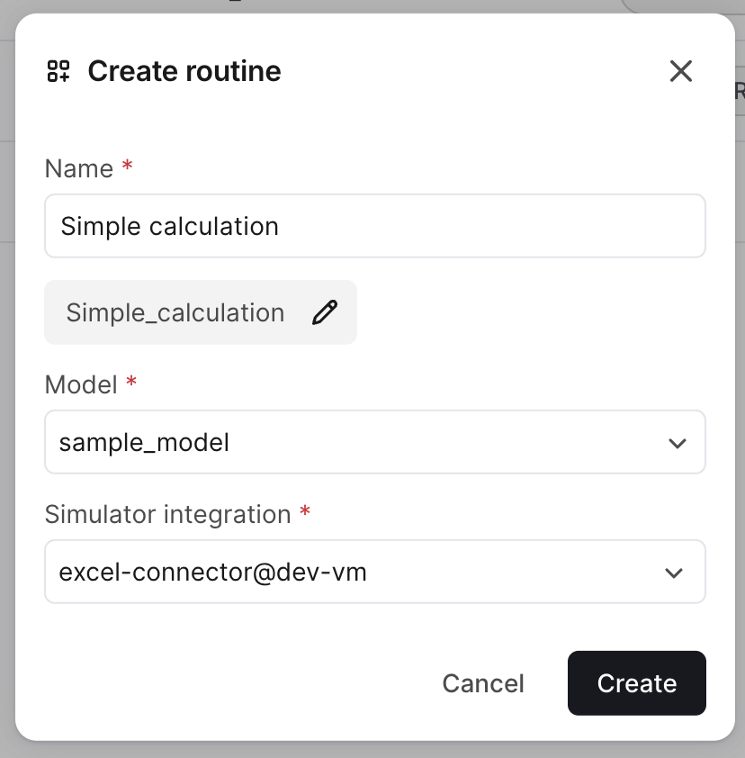
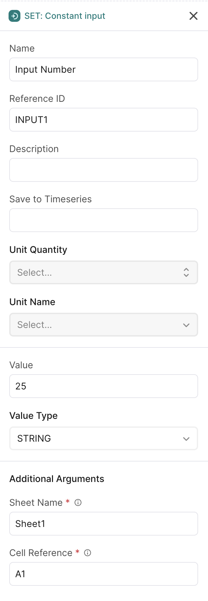
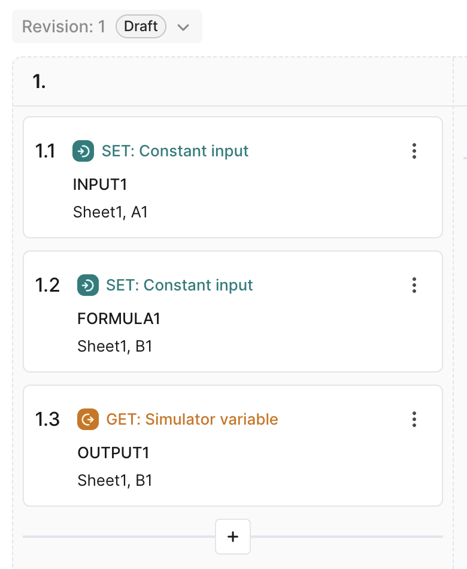

# Implement Simulation Routines

This guide shows you how to implement the **routine execution** functionality that allows your connector to run simulations based on instructions from CDF.

For detailed information about simulation routines in CDF, see the [Simulation Routines documentation](https://docs.cognite.com/cdf/integration/guides/simulators/simulator_routines).

## Prerequisites

You should have completed:
- [Create Your First Connector](create-connector.md) - Basic connector working
- [COM Connection Deep Dive](com-connection.md) - Understanding COM automation

**What you'll learn:**
- What routines and routine revisions are
- The three-method pattern (SetInput, GetOutput, RunCommand)
- Implementing `RoutineImplementationBase`
- Mapping CDF instructions to simulator operations

## Understanding Simulator Routines

A **simulator routine** is a folder that organizes different versions of simulator instructions. Each routine defines:

1. **Inputs** - Values to set in the simulator before running
2. **Outputs** - Values to read from the simulator after running
3. **Script** - Step-by-step instructions for the simulation

### Routine Revisions

Each **routine revision** is an immutable configuration that defines:
- **Inputs** - Constant values (STRING, DOUBLE, arrays) or time series references
- **Outputs** - Values to read and optionally save to time series
- **Script** - Ordered list of stages and steps for execution

### Routine Revision Structure

```
Routine Revision
├── Inputs (e.g., Temperature = 25°C, Pressure = 2 bar)
├── Outputs (e.g., FlowRate, Efficiency)
└── Script (ordered stages with steps)
    ├── Stage 1: Set inputs
    │   ├── Step 1: Set Temperature → Sheet1, Cell A1
    │   └── Step 2: Set Pressure → Sheet1, Cell A2
    ├── Stage 2: Run calculation
    │   └── Step 1: Command: Calculate
    └── Stage 3: Get outputs
        ├── Step 1: Get FlowRate ← Sheet1, Cell B1
        └── Step 2: Get Efficiency ← Sheet1, Cell B2
```

The SDK handles:
- Reading routine configuration from CDF
- Providing input values
- Orchestrating script execution
- Storing output values back to CDF

You implement:
- How to set each input in the simulator
- How to read each output from the simulator
- How to run commands in the simulator

## The Three-Method Pattern

All routine implementations follow the same pattern, regardless of integration type:

```csharp
public abstract class RoutineImplementationBase
{
    // Set an input value in the simulator
    public abstract void SetInput(
        SimulatorRoutineRevisionInput inputConfig,
        SimulatorValueItem input,
        Dictionary<string, string> arguments,
        CancellationToken token);

    // Get an output value from the simulator
    public abstract SimulatorValueItem GetOutput(
        SimulatorRoutineRevisionOutput outputConfig,
        Dictionary<string, string> arguments,
        CancellationToken token);

    // Run a command in the simulator
    public abstract void RunCommand(
        Dictionary<string, string> arguments,
        CancellationToken token);
}
```

**This pattern is universal** - whether you're using COM, TCP, REST, or any other integration method.

## Step 1: Create the Routine Class

Create `NewSimRoutine.cs`:

```csharp
using Microsoft.Extensions.Logging;
using CogniteSdk.Alpha;
using Cognite.Simulator.Utils;

public class NewSimRoutine : RoutineImplementationBase
{
    private readonly dynamic _workbook;

    private readonly ILogger logger;

    public NewSimRoutine(dynamic workbook, SimulatorRoutineRevision routineRevision, Dictionary<string, SimulatorValueItem> inputData, ILogger logger) : base(routineRevision, inputData, logger)
    {
        _workbook = workbook;
    }

    public override void SetInput(
        SimulatorRoutineRevisionInput inputConfig,
        SimulatorValueItem input,
        Dictionary<string, string> arguments,
        CancellationToken token)
    {
        // TODO: Implement
        throw new NotImplementedException();
    }

    public override SimulatorValueItem GetOutput(
        SimulatorRoutineRevisionOutput outputConfig,
        Dictionary<string, string> arguments,
        CancellationToken token)
    {
        // TODO: Implement
        throw new NotImplementedException();
    }

    public override void RunCommand(
        Dictionary<string, string> arguments,
        CancellationToken token)
    {
        // TODO: Implement
    }
}
```

**Key points:**
- Inherits from `RoutineImplementationBase`
- Receives the `workbook` (Excel COM object) in constructor
- Base class handles script orchestration
- We implement the three methods

## Step 2: Implement SetInput

The `SetInput` method writes values to the simulator.

### Understanding SetInput Parameters

```csharp
public override void SetInput(
    SimulatorRoutineRevisionInput inputConfig,  // Configuration from CDF
    SimulatorValueItem input,                   // Value to set
    Dictionary<string, string> arguments,       // Where to set it
    CancellationToken token)                    // Cancellation support
```

**Parameters:**
- **inputConfig** - Metadata (name, reference ID, value type)
- **input** - The actual value to set
- **arguments** - Step-specific arguments (e.g., `row`, `col`)
- **token** - Cancellation token

### Implementation

```csharp
public override void SetInput(
    SimulatorRoutineRevisionInput inputConfig,
    SimulatorValueItem input,
    Dictionary<string, string> arguments,
    CancellationToken token)
{
    ArgumentNullException.ThrowIfNull(input);
    ArgumentNullException.ThrowIfNull(arguments);

    // Extract sheet and cell reference from arguments
    var sheetName = arguments["sheet"];
    var cellReference = arguments["cell"];

    // Get the worksheet by name
    dynamic worksheet = _workbook.Worksheets(sheetName);
    dynamic cell = worksheet.Range(cellReference);

    // Set value based on type
    if (input.ValueType == SimulatorValueType.DOUBLE)
    {
        var rawValue = (input.Value as SimulatorValue.Double)?.Value ?? 0;
        cell.Value = rawValue;

        _logger.LogDebug($"Set {sheetName}!{cellReference} = {rawValue}");
    }
    else if (input.ValueType == SimulatorValueType.STRING)
    {
        var rawValue = (input.Value as SimulatorValue.String)?.Value;
        cell.Formula = rawValue;

        _logger.LogDebug($"Set {sheetName}!{cellReference} = '{rawValue}'");
    }
    else
    {
        throw new NotImplementedException($"{input.ValueType} not supported");
    }

    // Store reference for later use
    var simulatorObjectRef = new Dictionary<string, string>
    {
        { "sheet", sheetName },
        { "cell", cellReference }
    };
    input.SimulatorObjectReference = simulatorObjectRef;
}
```

**Key concepts:**

1. **Arguments** - Come from the routine script step, tell you WHERE to set the value
2. **Value extraction** - Cast `SimulatorValue` to concrete type (`Double`, `String`)
3. **Type handling** - Different value types may need different setter methods
4. **SimulatorObjectReference** - Store variable identifier

## Step 3: Implement GetOutput

The `GetOutput` method reads values from the simulator.

### Understanding GetOutput Parameters

```csharp
public override SimulatorValueItem GetOutput(
    SimulatorRoutineRevisionOutput outputConfig,  // Configuration from CDF
    Dictionary<string, string> arguments,         // Where to read from
    CancellationToken token)                      // Cancellation support
```

**Returns:** `SimulatorValueItem` containing the value read from the simulator.

### Implementation

```csharp
public override SimulatorValueItem GetOutput(
    SimulatorRoutineRevisionOutput outputConfig,
    Dictionary<string, string> arguments,
    CancellationToken token)
{
    ArgumentNullException.ThrowIfNull(outputConfig);
    ArgumentNullException.ThrowIfNull(arguments);

    // Extract sheet and cell reference
    var sheetName = arguments["sheet"];
    var cellReference = arguments["cell"];

    // Get the worksheet by name
    dynamic worksheet = _workbook.Worksheets(sheetName);
    dynamic cell = worksheet.Range(cellReference);

    // Read value based on expected type
    SimulatorValue value;

    if (outputConfig.ValueType == SimulatorValueType.DOUBLE)
    {
        var rawValue = (double)cell.Value;
        value = new SimulatorValue.Double(rawValue);
        _logger.LogDebug($"Read {sheetName}!{cellReference} = {rawValue}");
    }
    else if (outputConfig.ValueType == SimulatorValueType.STRING)
    {
        var rawValue = (string)cell.Text;
        value = new SimulatorValue.String(rawValue);
        _logger.LogDebug($"Read {sheetName}!{cellReference} = '{rawValue}'");
    }
    else
    {
        throw new NotImplementedException($"{outputConfig.ValueType} not supported");
    }

    // Create reference for where we read from
    var simulatorObjectRef = new Dictionary<string, string>
    {
        { "sheet", sheetName },
        { "cell", cellReference }
    };

    // Return the output item
    return new SimulatorValueItem
    {
        ValueType = outputConfig.ValueType,
        Value = value,
        ReferenceId = outputConfig.ReferenceId,
        SimulatorObjectReference = simulatorObjectRef,
        TimeseriesExternalId = outputConfig.SaveTimeseriesExternalId,
    };
}
```

**Key concepts:**

1. **Read from arguments** - Arguments tell you WHERE to read
2. **Type conversion** - Cast from COM `dynamic` to expected type
3. **Create SimulatorValueItem** - Wrap value in SDK type
4. **Preserve metadata** - Include reference ID and timeseries mapping

### Handling Null/Missing Values

Excel cells can be empty. Handle gracefully:

```csharp
var rawValue = cell.Value;

if (rawValue == null)
{
    _logger.LogWarning($"Cell [{row},{col}] is empty, using default");
    rawValue = 0.0;  // Or throw exception if required
}

var doubleValue = Convert.ToDouble(rawValue);
value = new SimulatorValue.Double(doubleValue);
```

## Step 4: Implement RunCommand

The `RunCommand` method executes simulator-specific operations.

### Understanding RunCommand

**When to use:**
- Triggering calculations
- Running solvers
- Saving/loading state
- Any action that doesn't involve setting/getting values

**For Excel:** Usually not needed (formulas calculate automatically).

### Implementation

```csharp
public override void RunCommand(
    Dictionary<string, string> arguments,
    CancellationToken token)
{
    ArgumentNullException.ThrowIfNull(arguments);
    var command = arguments["command"];

    switch (command)
    {
        case "Pause":
            {
                _workbook.Application.Calculation = -4135; // xlCalculationManual
                _logger.LogInformation("Calculation mode set to manual");
                break;
            }
        case "Calculate":
            {
                _workbook.Application.Calculate();
                _logger.LogInformation("Calculation completed");
                break;
            }
        default:
            {
                throw new NotImplementedException($"Unsupported command: '{command}'");
            }
    }
}
```

**Example for simulators that need explicit run:**

```csharp
public override void RunCommand(
    Dictionary<string, string> arguments,
    CancellationToken token)
{
    var command = arguments["command"];

    switch (command)
    {
        case "Calculate":
            _simulator.Run();
            _logger.LogInformation("Calculation completed");
            break;

        case "Solve":
            _simulator.Solve();
            _logger.LogInformation("Solver completed");
            break;

        case "Reset":
            _simulator.Reset();
            _logger.LogInformation("Simulator reset");
            break;

        default:
            throw new ArgumentException($"Unknown command: {command}");
    }
}
```

## Step 5: Update NewSimClient.RunSimulation

Now wire the routine into the `NewSimClient`:

```csharp
public async Task<Dictionary<string, SimulatorValueItem>> RunSimulation(DefaultModelFilestate modelState, SimulatorRoutineRevision routineRev, Dictionary<string, SimulatorValueItem> inputData, CancellationToken token)
{
    ArgumentNullException.ThrowIfNull(modelState);
    await semaphore.WaitAsync(token).ConfigureAwait(false);
    dynamic? workbook = null;
    try
    {
        Initialize();
        workbook = OpenBook(modelState.FilePath);

        var routine = new NewSimRoutine(workbook, routineRev, inputData, logger);
        return routine.PerformSimulation(token);
    }
    finally
    {
        if (workbook != null)
        {
            workbook.Close(false);
        }
        Shutdown();
        semaphore.Release();
    }
}
```

**What `PerformSimulation` does:**
1. Iterates through script steps in order
2. Calls your `SetInput`, `GetOutput`, or `RunCommand` based on step type
3. Handles cancellation
4. Returns dictionary of output values

## Step 6: Test with CDF

Now create a routine in CDF and test it.

### Create an Excel Test Model

Create a simple Excel file (`test-model.xlsx`):

| A | B |
|---|---|
| 10 | =A1 * 2 |

Save it and upload to CDF.

### Create a Routine and Revision


**CDF** -> **Simulators** -> **Routines** -> **Create Routine**



Setting inputs:

Set the first input (Sheet: Sheet1, Cell: A1, Value : 25)
Set the second input (Sheet: Sheet1, Cell: B1, Value: "=A1 * 2")
Set the output (Sheet: Sheet1, Cell: B1)




Routine in CDF



### Run the Routine

In the CDF UI, navigate to **Simulators** > **Routines**, find "Simple Calculation", click **Run now**, and view the results in the **Run browser**.

**Expected result:** Output "Result" = 50.0

## Understanding Arguments

Arguments connect the routine script to your implementation.

### Defining Arguments in SimulatorDefinition

Remember in `SimulatorDefinition.cs`:

```csharp
StepFields = new List<SimulatorStepField>
{
    new SimulatorStepField
    {
        StepType = "get/set",
        Fields = new List<SimulatorStepFieldParam>
        {
            new SimulatorStepFieldParam
            {
                Name = "sheet",
                Label = "Sheet Name",
                Info = "Name of the worksheet (e.g., 'Sheet1')",
            },
            new SimulatorStepFieldParam
            {
                Name = "cell",
                Label = "Cell Reference",
                Info = "Excel cell reference (e.g., 'A1', 'B2', 'C3')",
            },
        },
    },
}
```

This defines what arguments the CDF API will ask for when creating routine steps.

### Using Arguments in Script

When a user creates a step in CDF, they provide values for these arguments:

```json
{
  "stepType": "Set",
  "arguments": {
    "referenceId": "INPUT1",
    "sheet": "Sheet1",
    "cell": "A5"
  }
}
```

### Accessing Arguments in Code

```csharp
public override void SetInput(
    SimulatorRoutineRevisionInput inputConfig,
    SimulatorValueItem input,
    Dictionary<string, string> arguments,
    CancellationToken token)
{
    // Arguments dictionary contains script-provided values
    var sheetName = arguments["sheet"];    // "Sheet1"
    var cellReference = arguments["cell"]; // "A5"

    // Use them to locate where to set the value
    dynamic worksheet = _workbook.Worksheets(sheetName);
    dynamic cell = worksheet.Range(cellReference);
    cell.Value = (input.Value as SimulatorValue.Double)?.Value;
}
```

> **Important:** Argument names in `SimulatorDefinition` must exactly match keys used in your code.

---

**Next:** Continue to [Testing](testing.md) to learn how to test your connector.