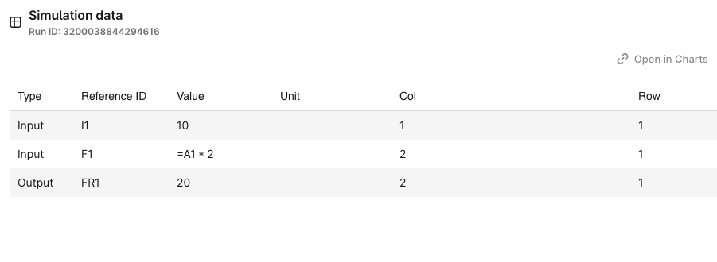

# Implement RoutineImplementationBase

Routine is an entity that contains configuration of the input and output parameters needed for the simulation.
It also contains a list of instructions for the connector to pass into the simulation model.
In this tutorial we will implement the actual communication between the connector and a simulator using COM interface.

First, create a class that inherits from `RoutineImplementationBase`.


NewSimRoutine.cs:
```csharp
using Cognite.Simulator.Utils;
using CogniteSdk.Alpha;

public class NewSimRoutine : RoutineImplementationBase
{
    private readonly dynamic _workbook;


    public NewSimRoutine(dynamic workbook, SimulatorRoutineRevision routineRevision, Dictionary<string, SimulatorValueItem> inputData) : base(routineRevision, inputData)
    {
        _workbook = workbook;
    }

    public override void SetInput(SimulatorRoutineRevisionInput inputConfig, SimulatorValueItem input, Dictionary<string, string> arguments)
    {
        var rowStr = arguments["row"];
        var colStr = arguments["col"];
        var row = int.Parse(rowStr);
        var col = int.Parse(colStr);

        dynamic worksheet = _workbook.ActiveSheet;
        SimulatorValue value;

        if (input.ValueType == SimulatorValueType.DOUBLE)
        {
            var rawValue = (input.Value as SimulatorValue.Double)?.Value ?? 0;
            worksheet.Cells[row, col].Value = rawValue;
            value = SimulatorValue.Create(rawValue);
        } else if (input.ValueType == SimulatorValueType.STRING)
        {
            var rawValue = (input.Value as SimulatorValue.String)?.Value;
            worksheet.Cells[row, col].Formula = rawValue;
            value = SimulatorValue.Create(rawValue);
        } else {
            throw new NotImplementedException($"{input.ValueType} not implemented");
        }

        var simulationObjectRef = new Dictionary<string, string> { { "row", rowStr }, { "col", colStr } };
        input.SimulatorObjectReference = simulationObjectRef;
        input.Value = value;
    }

    public override SimulatorValueItem GetOutput(SimulatorRoutineRevisionOutput outputConfig, Dictionary<string, string> arguments)
    {
        var rowStr = arguments["row"];
        var colStr = arguments["col"];
        var row = int.Parse(rowStr);
        var col = int.Parse(colStr);

        dynamic worksheet = _workbook.ActiveSheet;
        var cell = worksheet.Cells[row, col];

        if (outputConfig.ValueType != SimulatorValueType.DOUBLE)
        {
            throw new NotImplementedException($"{outputConfig.ValueType} value type not implemented");
        }

        var rawValue = (double) cell.Value;
        SimulatorValue value = new SimulatorValue.Double(rawValue);

        var simulationObjectRef = new Dictionary<string, string> { { "row", rowStr }, { "col", colStr } };

        return new SimulatorValueItem
        {
            ValueType = SimulatorValueType.DOUBLE,
            Value = value,
            ReferenceId = outputConfig.ReferenceId,
            SimulatorObjectReference = simulationObjectRef,
            TimeseriesExternalId = outputConfig.SaveTimeseriesExternalId,
        };
    }

    public override void RunCommand(Dictionary<string, string> arguments)
    {
        // No implementation needed for this simulator
    }
}
```
This class will be used to perform the simulation.
The `SetInput` method is used to set the input values for the simulation. The `GetOutput` method is used to get the output values from the simulation. The `RunCommand` method is used to run commands in the simulation, but it is not needed for this simulator as the results are calculated immediatelly on the worksheet.

#### Implement `RunSimulation` method in `NewSimClient`

At this point we need to call the `PerformSimulation` method in the `NewSimRoutine` class. This method will perform the simulation and return the results.
We aquire the lock to ensure only a single connection to the simulator is made at a time.

```csharp
public Task<Dictionary<string, SimulatorValueItem>> RunSimulation(DefaultModelFilestate modelState, SimulatorRoutineRevision routineRev, Dictionary<string, SimulatorValueItem> inputData)
    {
        lock (simulatorLock)
        {
            dynamic workbook = null;
            try
            {
                Initialize();
                workbook = OpenBook(modelState.FilePath);

                var routine = new NewSimRoutine(workbook, routineRev, inputData);
                return Task.FromResult(routine.PerformSimulation());
            }
            finally
            {
                if (workbook != null)
                {
                    workbook.Close(false);
                }
                Shutdown();
            }
        }
    }
```

Not we can call the API and create aa new routine and routine revision. We can then call the `RunSimulation` method to perform the simulation.

Routine:
```
POST {{baseUrl}}/api/v1/projects/{{project}}/simulators/routines
{
  "items": [{
        "externalId": "simple-computations",
        "modelExternalId": "empty_book",
        "simulatorIntegrationExternalId": "new-test-connector@computer",
        "name": "Simple computations"
    }]
}
```

Routine revision:
```
POST {{baseUrl}}/api/v1/projects/{{project}}/simulators/routines/revisions

{
    "items": [{
        "externalId": "simple-computations-1",
        "routineExternalId": "simple-computations",
        "configuration": {
            "schedule": {
                "enabled": false
            },
            "dataSampling": {
                "enabled": false
            },
            "logicalCheck": [],
            "steadyStateDetection": [],
            "inputs": [
                {
                    "name": "Number",
                    "referenceId": "I1",
                    "value": 10.0,
                    "valueType": "DOUBLE"
                },
                {
                    "name": "Formula",
                    "referenceId": "F1",
                    "value": "=A1 * 2",
                    "valueType": "STRING"
                }
            ],
            "outputs": [
                {
                    "name": "Formula Result",
                    "referenceId": "FR1",
                    "valueType": "DOUBLE"
                }
            ]
        },
        "script": [
            {
                "order": 1,
                "description": "Set Inputs",
                "steps": [
                    {
                        "order": 1,
                        "stepType": "Set",
                        "arguments": {
                            "referenceId": "I1",
                            "row": "1",
                            "col": "1"
                        }
                    },
                    {
                        "order": 2,
                        "stepType": "Set",
                        "arguments": {
                            "referenceId": "F1",
                            "row": "1",
                            "col": "2"
                        }
                    }
                ]
            },
            {
                "order": 3,
                "description": "Set outputs",
                "steps": [
                    {
                        "order": 1,
                        "stepType": "Get",
                        "arguments": {
                            "referenceId": "FR1",
                            "row": "1",
                            "col": "2"
                        }
                    }
                ]
            }
        ]
    }]
}
```

Let's try to run the simulation and see the results.

Click on the routine and then click on the `Run now` button.


When the simulation is finished, you can see the details in the `Run browser` tab.


Click `View data` to see the results of the simulation.



