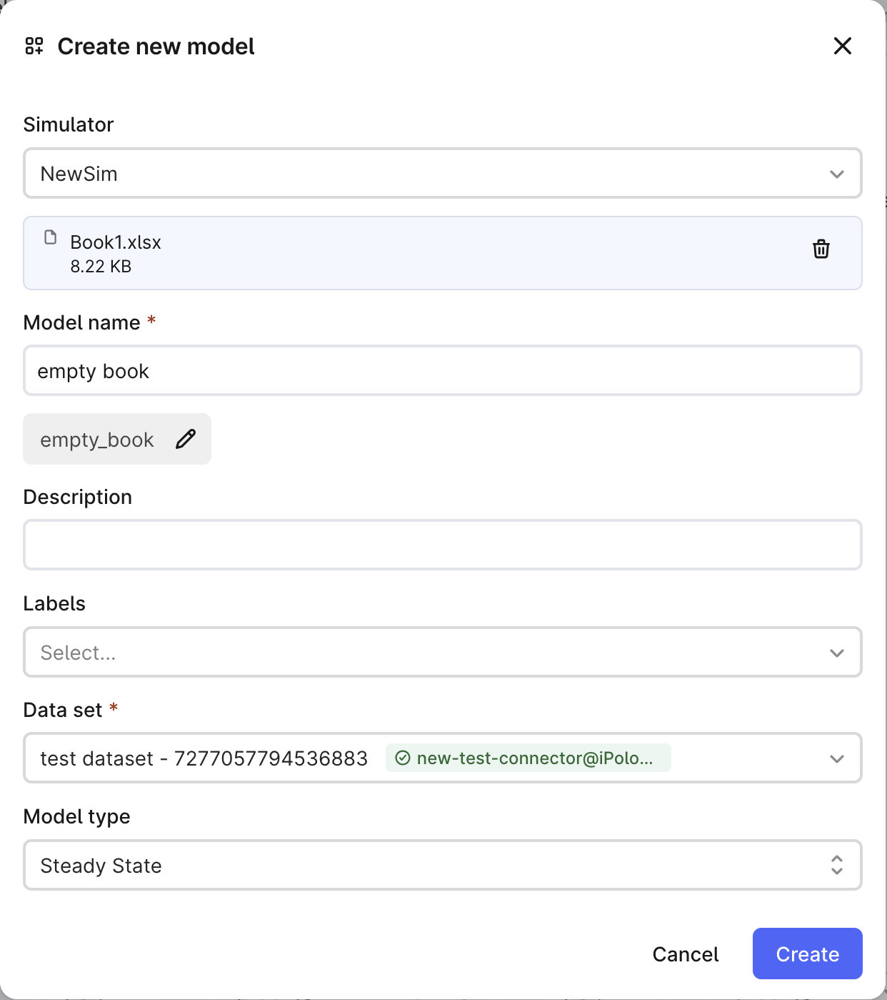
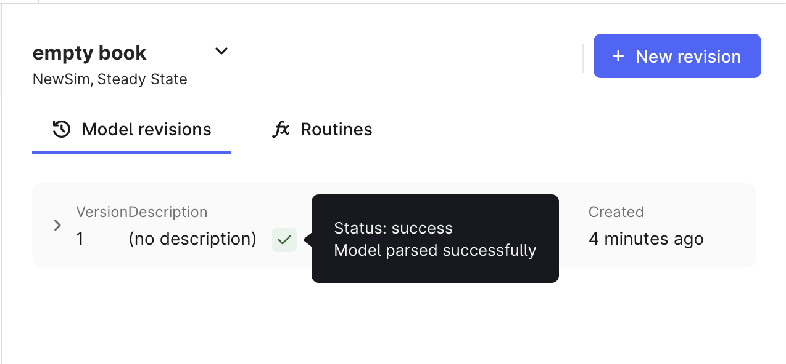

# Implement model parsing

To be able to run simulations using the Cognite simulator integration, we need to be able to open the model file and extract the necessary information from it first.
We will use an empty Excel sheet as a model file for this example.

### Implement COM call to open the Excel file:

Simply copy the following method to the `NewSimClient` class.

```csharp
public dynamic OpenBook(string path)
{
    dynamic workbooks = Server.Workbooks;
    return workbooks.Open(path);
}
```

### Implement the ExtractModelInformation method in the NewSimClient class:

This method is used to extract the model information from the simulator.
For the sake of this example we will only open the Excel `.xlsx` file.

If the file is opened successfully, we will set the parsing info to `success`, otherwise to `failure`.

```csharp
public async Task ExtractModelInformation(DefaultModelFilestate state, CancellationToken _token)
    {
        lock (simulatorLock)
        {
            try
            {
                Initialize();
                dynamic workbook = OpenBook(state.FilePath);
                if (workbook != null)
                {
                    workbook.Close(false);
                    state.ParsingInfo.SetSuccess();
                    return;
                }
                state.ParsingInfo.SetFailure();
            }
            finally
            {
                Shutdown();
            }
        }
    }
```
Note that we are closing the workbook after opening it.
The boolean parameter in `workbook.Close(false);` also ensures that the workbook changes are not saved.
If we fail to close the file, it won't be possible to run multiple simulations with the same model.


Updated `NewSimClient` class:

```csharp
using Cognite.Simulator.Utils;
using Cognite.Simulator.Utils.Automation;
using CogniteSdk.Alpha;
using Microsoft.Extensions.Logging;

public class NewSimClient : AutomationClient, ISimulatorClient<DefaultModelFilestate, SimulatorRoutineRevision>
{
    private readonly object simulatorLock = new object();
    private readonly string _version = "N/A";

    public NewSimClient(ILogger<NewSimClient> logger, DefaultConfig<NewSimAutomationConfig> config)
            : base(logger, config.Automation)
    {
        lock (simulatorLock)
        {
            try
            {
                Initialize();
                _version = Server.Version;
            }
            finally
            {
                Shutdown();
            }
        }
    }

    public dynamic OpenBook(string path)
    {
        dynamic workbooks = Server.Workbooks;
        return workbooks.Open(path);
    }

    public async Task ExtractModelInformation(DefaultModelFilestate state, CancellationToken _token)
    {
        lock (simulatorLock)
        {
            try
            {
                Initialize();
                dynamic workbook = OpenBook(state.FilePath);
                if (workbook != null)
                {
                    workbook.Close(false);
                    state.ParsingInfo.SetSuccess();
                    return;
                }
                state.ParsingInfo.SetFailure();
            }
            finally
            {
                Shutdown();
            }
        }
    }

    public string GetConnectorVersion()
    {
        return "N/A";
    }

    public string GetSimulatorVersion()
    {
        return _version;
    }

    public Task<Dictionary<string, SimulatorValueItem>> RunSimulation(DefaultModelFilestate modelState, SimulatorRoutineRevision simulationConfiguration, Dictionary<string, SimulatorValueItem> inputData)
    {
        throw new NotImplementedException();
    }

    protected override void PreShutdown()
    {
        Server.Quit();
    }
}
```

Now, using the Fusion interface we can upload an empty Excel file and observe its status.

Upload the file:


Model has been successfully parsed:

