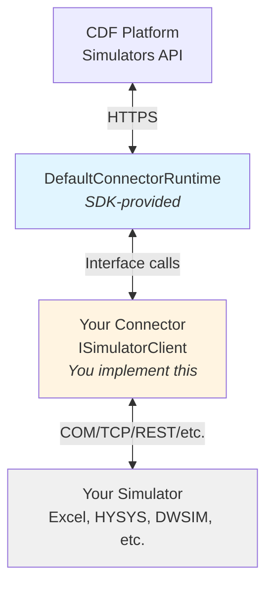

# Understanding Simulator Integration

This guide explains how simulators can be integrated with Cognite Data Fusion (CDF) and provides an overview of different integration patterns supported by the SDK.

For comprehensive information about CDF's simulator integration capabilities, see the [official CDF Simulators documentation](https://docs.cognite.com/cdf/integration/guides/simulators/).

## Integration approaches overview

Simulators can be integrated with CDF using various communication methods, depending on how the simulator exposes its functionality. The Simulator Integration SDK is designed to support multiple integration approaches while providing a consistent interface to CDF.

### Common integration types

**1. COM Automation (Component Object Model)**
- **When to use**: Windows-based simulators that expose COM interfaces
- **Examples**: Petro-SIM, Symmetry, HYSYS, UniSim Design, DWSIM
- **Platform**: Windows only
- **Characteristics**: In-process or out-of-process object access, method calls via COM IDispatch
- **SDK Support**: `AutomationClient` helper class available

**2. TCP/Socket Communication**
- **When to use**: Simulators that run as separate processes with network interfaces
- **Examples**: Simulators which expose some form of socket APIs
- **Platform**: Cross-platform
- **Characteristics**: Text or binary protocol over TCP, process lifecycle management needed
- **SDK Support**: Direct `ISimulatorClient` implementation

**3. REST/HTTP APIs**
- **When to use**: Simulators that expose web service interfaces
- **Examples**: Cloud-based simulators, modern simulators with HTTP APIs
- **Platform**: Cross-platform
- **Characteristics**: HTTP requests/responses, typically JSON payloads
- **SDK Support**: Direct `ISimulatorClient` implementation with HttpClient

**4. Native Library Integration (DLL/Shared Object)**
- **When to use**: Simulators that provide native libraries
- **Examples**: Simulators with native SDKs
- **Platform**: Platform-specific binaries
- **Characteristics**: Direct function calls via P/Invoke, architecture must match
- **SDK Support**: Direct `ISimulatorClient` implementation with P/Invoke

**5. File-Based Integration**
- **When to use**: Batch simulators or legacy systems without APIs
- **Examples**: Simulators that read input files and write output files
- **Platform**: Cross-platform
- **Characteristics**: File system I/O, polling or file watchers
- **SDK Support**: Direct `ISimulatorClient` implementation

## About this tutorial

### Tutorial strategy

**This tutorial uses Excel as the integration example.** Here's why:
- **Universally Accessible**: Everyone has access to Excel, making the tutorial hands-on and testable
- **Real COM Integration**: Excel uses the same COM automation that many industrial simulators use
- **Immediate Feedback**: You can see results in the spreadsheet, making learning concrete
- **Pattern Demonstration**: The patterns shown work for any COM-based simulator

**The patterns and principles demonstrated in this tutorial apply broadly to simulator integration**, regardless of the specific communication method your simulator uses.

### What you'll learn

By following this tutorial, you'll learn:

1. **Core SDK Concepts** - Interfaces, runtime, configuration (applies to all integration types)
2. **Connection Management** - How to establish and maintain simulator connections
3. **Model Parsing** - How to extract model structure and properties
4. **Routine Implementation** - How to map CDF routine steps to simulator operations

## SDK architecture overview

The Simulator Integration SDK provides a framework that handles CDF integration while you focus on simulator-specific logic.

### What the SDK provides

**CDF integration** (you don't need to implement):
- Communication with CDF APIs
- Model and routine synchronization
- Simulation scheduling and execution
- Result storage
- State management

**Your responsibilities** (you implement):
- Connecting to your simulator
- Validating models and extracting model information
- Executing simulation steps
- Reading and writing simulator data

Learn more about [how connectors work](https://docs.cognite.com/cdf/integration/guides/simulators/connectors/).

### Core interfaces

You'll implement three main components:

**1. ISimulatorClient**
- Manages connection to the simulator
- Reports versions
- Extracts model information
- Executes simulations

**2. RoutineImplementationBase**
- Sets input values
- Gets output values
- Runs commands

**3. Configuration**
- Defines simulator connection settings
- Inherits from `AutomationConfig` (or creates custom config)

### Integration flow



## Universal integration patterns

While connection mechanisms differ, the **integration patterns remain consistent**:

### Pattern: three-method routine
All connectors implement the same three methods:
- `SetInput()` - Write values to simulator
- `GetOutput()` - Read values from simulator
- `RunCommand()` - Execute simulator operations

### Pattern: property structure
All connectors describe properties the same way:
- Name, value type, unit
- Reference information for addressing
- Read/write permissions

### Pattern: model representation
All connectors parse models into the same structure:
- Nodes (streams, equipment)
- Edges (connections)
- Properties with units
- Thermodynamic data

### Pattern: error handling
All connectors use consistent logging and exception patterns

## Platform considerations

Different integration approaches have different platform requirements.

**For this tutorial**: We use Excel (COM), which requires Windows. The SDK itself supports cross-platform deployment when using appropriate integration methods.

### Understanding Runtime Identifiers (RID)

A Runtime Identifier (RID) specifies the platform and architecture where your application runs.

**Common RIDs:**

**Windows:**
- `win-x64` - Windows 64-bit
- `win-x86` - Windows 32-bit
- `win-arm64` - Windows ARM 64-bit

**Linux:**
- `linux-x64` - Linux 64-bit
- `linux-arm` - Linux ARM 32-bit
- `linux-arm64` - Linux ARM 64-bit

**macOS:**
- `osx-x64` - macOS 64-bit (Intel)
- `osx-arm64` - macOS ARM 64-bit (Apple Silicon)

**Specifying RID in your project:**

Add the RID to your `.csproj` file:

```xml
<Project Sdk="Microsoft.NET.Sdk">
  <PropertyGroup>
    <OutputType>Exe</OutputType>
    <TargetFramework>net8.0</TargetFramework>
    <RuntimeIdentifier>win-x64</RuntimeIdentifier>
  </PropertyGroup>
</Project>
```

**When to specify RID:**
- When your connector uses platform-specific features (like COM)
- When architecture matching is required
- When creating self-contained deployments

### When Architecture Matters

Architecture matching is **critical** when your connector directly interacts with native code:

**1. COM Automation**
- Your connector architecture must match the COM application architecture
- 32-bit simulator → 32-bit connector (`win-x86`)
- 64-bit simulator → 64-bit connector (`win-x64`)

**2. Native DLL Interop (P/Invoke)**
- Your connector must match the DLL architecture
- 32-bit DLL requires 32-bit connector
- 64-bit DLL requires 64-bit connector

**3. Process-to-Process Communication (TCP/REST)**
- Architecture matching is **not required**
- Your connector can be any architecture
- The simulator process runs independently

---

**Next:** Continue to [Prerequisites & Setup](prerequisites.md) to set up your development environment.
